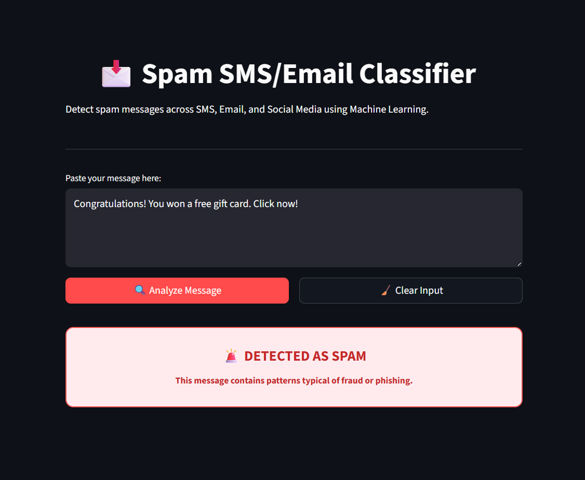

# Create README.md file with the provided content

📩 SMS Spam Detection App (Streamlit)

A simple machine-learning web app that classifies SMS messages as **Spam** or **Not Spam** using NLP and a trained ML model.  
Built with **Python**, **scikit-learn**, and **Streamlit**.

---

## 🚀 Features

- Real-time SMS spam prediction
- Text preprocessing (tokenization, stopword removal, stemming)
- TF-IDF based feature extraction
- Lightweight ML model (fast inference)
- Minimal, clean Streamlit UI

---

## 🧠 Model Overview

- **Problem**: Binary text classification (Spam vs Ham)
- **Approach**:
  - Text preprocessing using **NLTK**
  - Vectorization using **TF-IDF**
  - Classification using a trained ML model
- **Input**: Raw SMS text
- **Output**: Spam or Not Spam

Congratulations! You won a free gift card. Click now!
🚨 Spam Message

---

